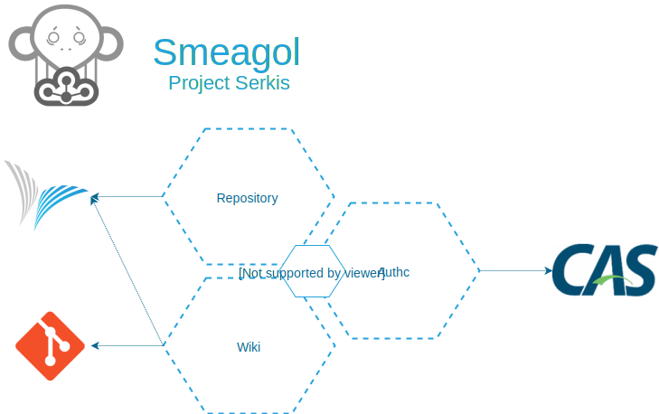

# Architecture

## Bounded Contexts

Smeagol comprises of Bounded Contexts (BC) in terms of Domain-Driven Design (DDD) that ideally would share nothing.
This promises to separate domain from technical concerns. It divides complexity into different Bounded Contexts.

As the account must be read from the session in all BCs, we avoid duplication by using a Shared Kernel. 
 

### Shared Kernel

The shared kernel hosts classes, which are required by each BC.

### Authc

This BC is responsible for the whole process of authentication.

### Repository

The Repository BC is responsible for the listing of available repositories and their branches.

### Wiki

The Wiki BC is the heart of Smeagol and is responsible for the wiki itself. This part was previously realized with [Gollum](https://github.com/gollum/gollum).

## Hexagonal Architecture 

Within each Bounded Context we use our interpretation of a hexagonal architecture (aka [Clean Architecutre, Onion Architecture, etc.](https://8thlight.com/blog/uncle-bob/2012/08/13/the-clean-architecture.html)) with the following layers:

* Domain: Contains Domain logic only (no technical stuff). Defines value objects, entities, repository *interfaces* and services.
* Use cases: Exposes actions (write operations) that are possible on the domain.
  We use the Command Bus pattern here. Advantage: Commands provide an overview of domain operations allowed by the system. 
  They are implemented using a concrete pattern and are not just another thing called "service".   
* Infrastructure: Contains all the technical stuff: REST controllers, repository *implementations* and all the glue.

Access is only allowed in the following direction: Infrastructure -> Use cases -> Domain

## UI Architecture

The UI uses a [Flux based architecture](https://facebook.github.io/flux), which is build with [Redux](https://redux.js.org/).
The code is separated in a shared kernel and the BC's analog to the REST API. The shared kernel consists only of 
components which are required in each BC, some infrastructure and bootstrap logic. Each BC is divided into components,
containers and modules. 

* Components should be stateless (or should only have a local state). This means each required property
must hand over by a higher ordered intelligent component. 
* Containers are higher ordered components and this are the components which are connected to the store. 
* __Modules__ are the last part of the puzzle. Modules are responsible for the state of the application. They manage the 
actions and reducers which are required to modify the state.

Access is only allowed in the following direction: Containers -> Components -> Modules

**TODO**: modules is to general, perhaps store?

## Mapping to Code

### Java (src/main/java)

* Shared Kernel: Base Package `com.cloudogu.smeagol`
  The base package also contains the entry point of our application.
* Bounded Contexts map to subpackages of the base package, e.g.
   * `com.cloudogu.smeagol.authc`
   * `com.cloudogu.smeagol.repository`
* The hexagonal layers map to subpackages of the individual Bounded Context packages, e.g.
   * `com.cloudogu.smeagol.repository.infrastructure`
   * `com.cloudogu.smeagol.repository.domain`
   
### JavaScript (src/main/js)

* Shared Kernel: The .js files directly under js
* Bounded Contexts map to folders, e.g.:
   * `repository`
   * `wiki`
* Containers, components and __modules__ are mapped to sub folders of each Bounded Context.
   
### Technical Terms

* Repository: repository in terms of DDD for accessing -> Note: We also have a domain object called repository referring to a Git or SCM-Manager repository
* Controller: REST Controller, i.e. endpoint (returns resources).
* Resource: DTO that maps entity to the REST interface (returned by a Controller)
