# Oberfläche

Smeagol ist ein Wiki-System auf Basis eines Git-Repositorys. Das bedeutet, dass nicht nur der Quellcode des Softwareprodukts, sondern auch die zugehörige Dokumentation im Git-Repository versioniert wird. Dadurch ist die Dokumentation genau dort, wo sie auch hingehört – direkt neben dem Source Code.  

Die Dokumentation kann bequem über eine Weboberfläche aufgerufen werden, wobei jede Nutzerin und jeder Nutzer die Wikis der Repositories sehen kann, auf die er auch im SCM-Manager Zugriff hat. Die Funktion der Weboberfläche ist aber nicht nur auf die Anzeige der Inhalte beschränkt: Sie erlaubt es der Nutzerin und dem Nutzer auch, die Dokumentation zu bearbeiten (inklusive Live-Vorschau und Unterstützung für die Erstellung von Diagrammen mittels PlantUML Syntax) und die bereits erstellten Inhalte zu durchsuchen. Darüber hinaus kann man sich die Versionshistorie der Wikis, eine Übersicht aller Dokumentationsdateien eines Repositorys, sowie globale Änderungen anzeigen lassen. Es können weiterhin Einstellungen wie die Startseite und das Verzeichnis, in dem die Dokumentationen abgelegt werden sollen, vorgenommen werden.

Um Smeagol für ein Repository verwenden zu können, muss lediglich eine leere 
".smeagol.yml"-Datei im Root-Verzeichnis des Repositorys angelegt werden. Dies ist auch direkt in der Weboberfläche möglich. Standardmäßig sind Repositories ohne Wiki ausgeblendet. Um diese anzuzeigen, muss in der Übersicht die Checkbox "Repositories ohne Wiki anzeigen" aktiviert werden.

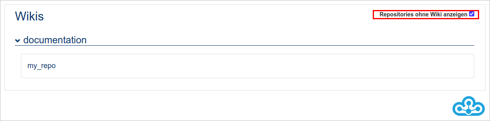

Wird in der Weboberfläche ein Repository ohne Wiki angewählt, kann nach Auswählen des Branches, auf dem gearbeitet werden soll, durch den Button "Wiki initialisieren" ein neues Wiki angelegt werden (Die smeagol.yml wird automatisch erzeugt).

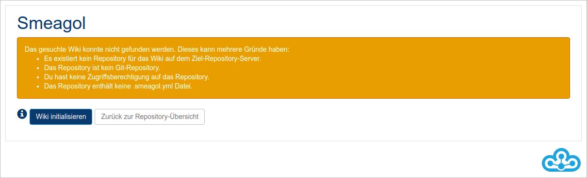

Anschlie&szlig;end kann die Dokumentation entweder auf der Smeagol-Weboberfläche oder über einen gängigen Editor erstellt werden, je nachdem wie bevorzugt gearbeitet wird. Diesen Prozess finden Sie nachfolgend skizziert.

Über die Weboberfläche können bestehende Seiten verändert und neue angelegt werden. Sobald Änderungen gespeichert werden, führt Smeagol automatisch einen Push an das Repository durch und versioniert damit die Dokumentation. Bei der Verwendung eines Editors muss dies manuell geschehen. Für die Erstellung der Dokumentation kann zwischen mehreren Syntaxen, wie z.B. Markdown oder Rdoc, gewählt werden.

Alle Repositories, die über eine smeagol.yml verfügen, werden in der Wikis-Übersicht angezeigt.

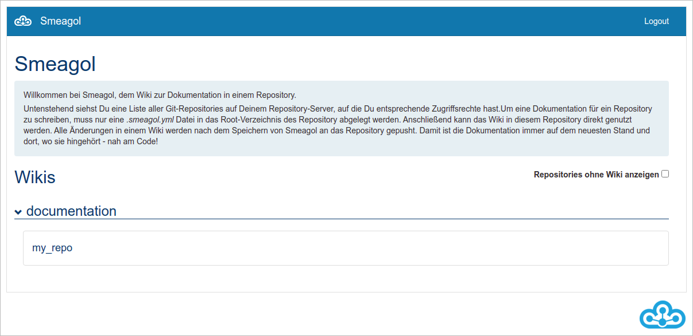

Wenn Sie auf das Wiki klicken, bekommen Sie eine Übersicht aller Branches in dem Repository.

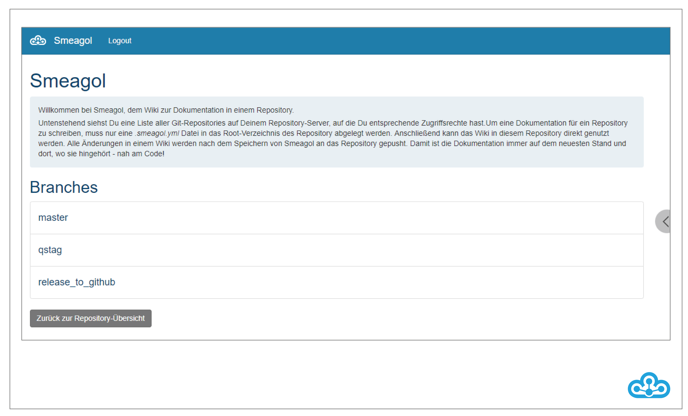

Mit einem Klick auf den gewünschten Branch werden Sie auf die Wiki-Seite weitergeleitet.
Mit der Suchfunktion kann das Wiki nach Begriffen durchsucht werden. Mit dem Button "Startseite" werden Sie wieder auf die erste Seite des Wikis geleitet.
Das Root-Verzeichnis (standardmäßig "docs") und die Hauptseite (also jene Seite, die beim Anwählen des Repositorys zuerst angezeigt wird) können außerdem über die Schaltfläche
"Einstellungen" angepasst werden.

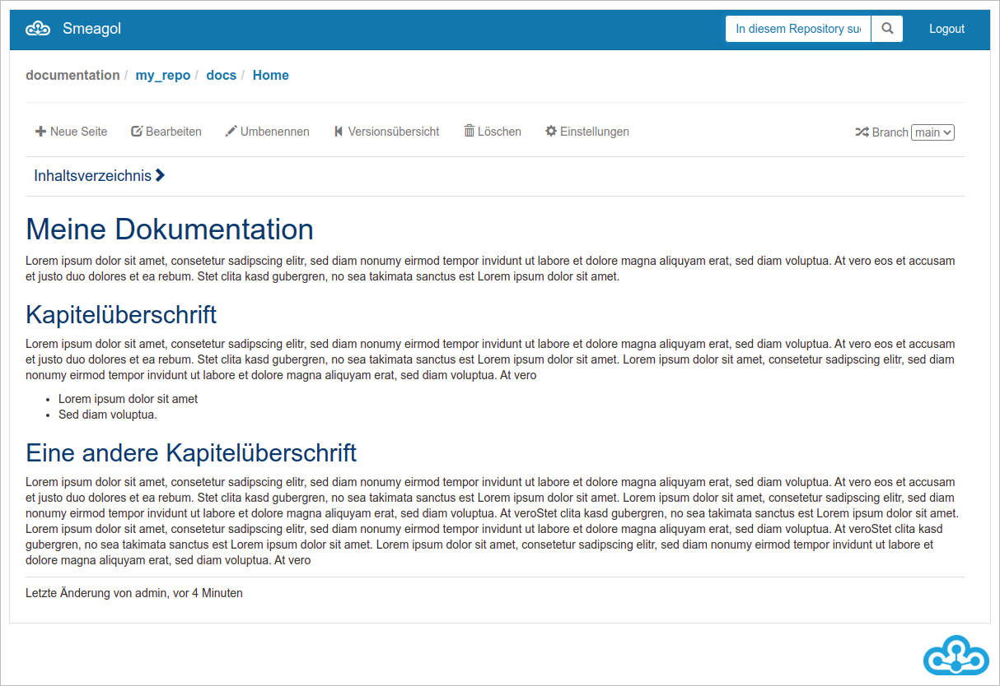

Über das Breadcrumb ist eine einfache Navigation durch das Wiki möglich. Sollen bspw. alle Seiten zu dem zugehörigen Wiki aufgelistet werden, reicht ein Klick auf das oberste Verzeichnis "docs".

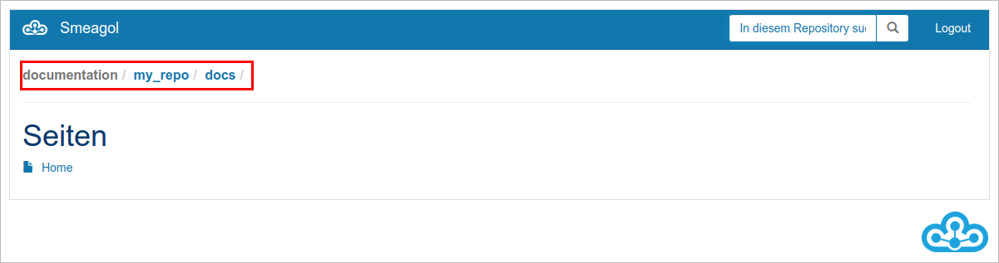

Bei langen Wikis ist das ausklappbare Inhaltsverzeichnis eine große Hilfe. Es wird automatisch bei Änderungen am Wiki aktualisiert und orientiert sich an den Überschriften. Diese dienen als Sprungmarken auf den jeweiligen Abschnitt.

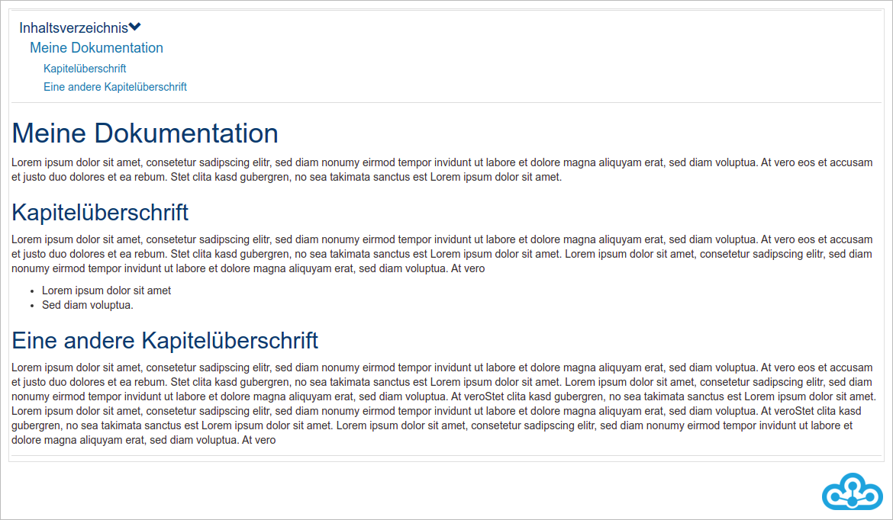

Mit der Schaltfläche "Neue Seite" wird eine neue Wiki-Seite erstellt. Sie müssen einen Namen für die Seite festlegen und können anschlie\ss end mit "OK" die Seite anlegen.

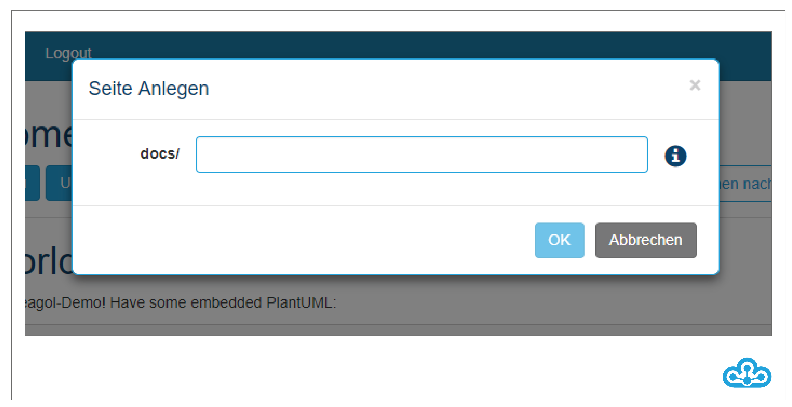

Unter "Umbenennen" können Sie die aktuell ausgewählte Seite umbenennen. Dafür geben Sie den neuen Namen an und bestätigen mit "OK".

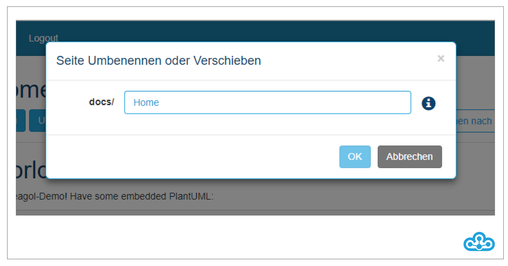

Über "Löschen" können Seiten wieder gelöscht werden.

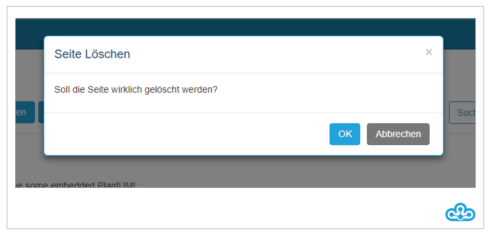

Unter "Bearbeiten" öffnet sich der Editor und Sie können die Seite direkt im Browser ändern. Sie haben die Möglichkeit, sich neben der Bearbeitung eine Vorschau anzeigen zu lassen ("Markdown") oder einen zusammengefassten Editor zu nutzen ("WYSIWYG"). Mit einem Kommentar können Sie Änderungen an der Seite speichern.

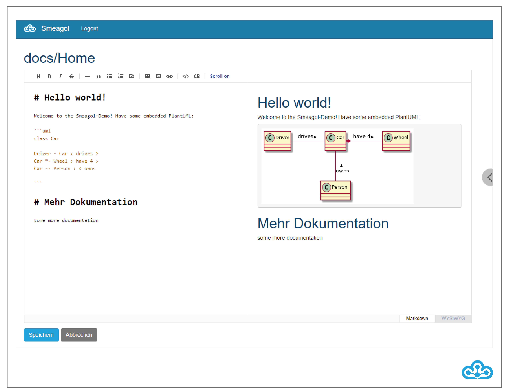

In der Versionsübersicht werden alle Änderungen der gerade ausgewählten Wiki-Seite angezeigt.

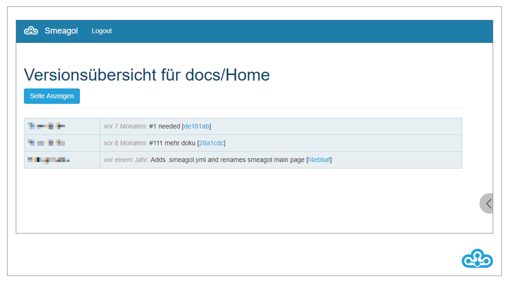

Rechts in der Menüleiste kann der eingangs gewählte Branch verändert werden.

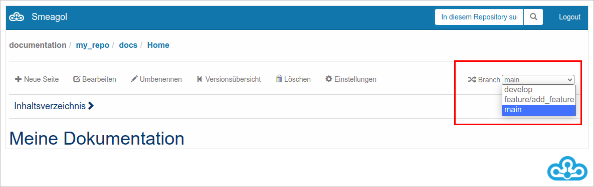

