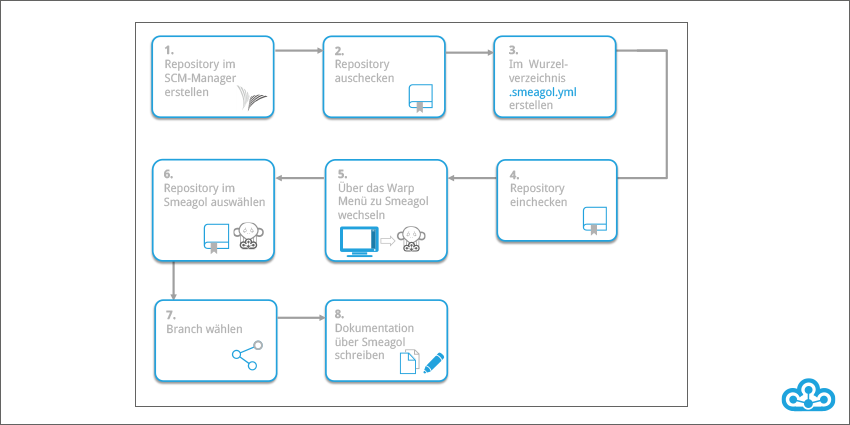
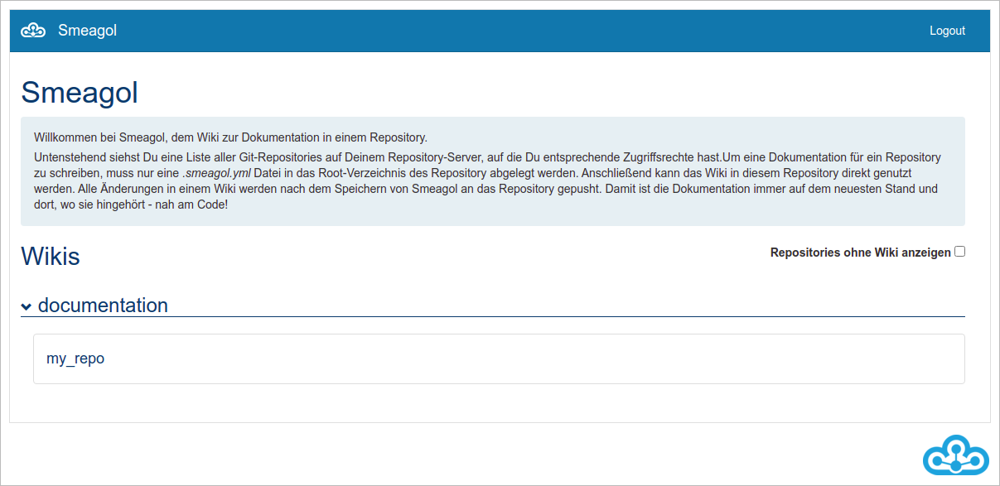
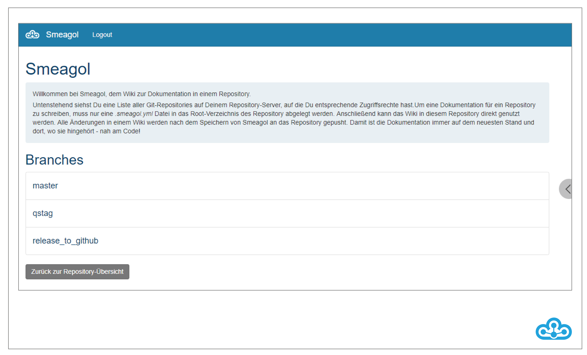
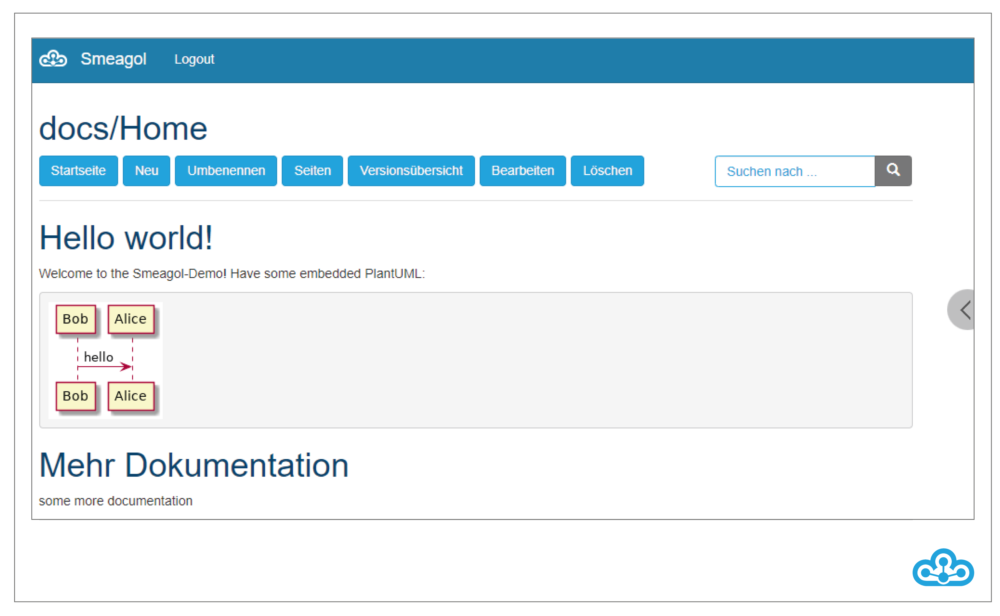
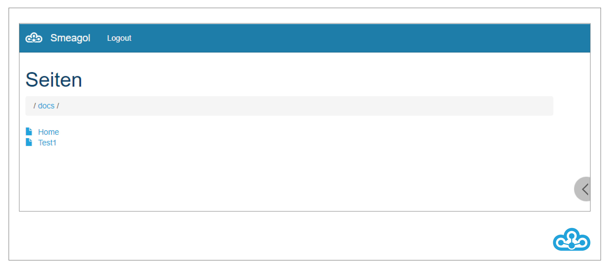
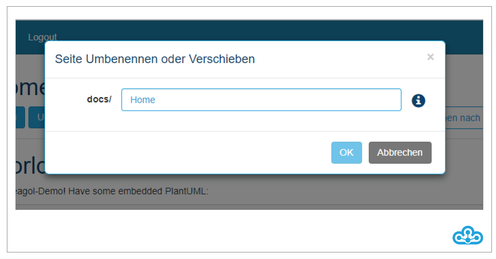
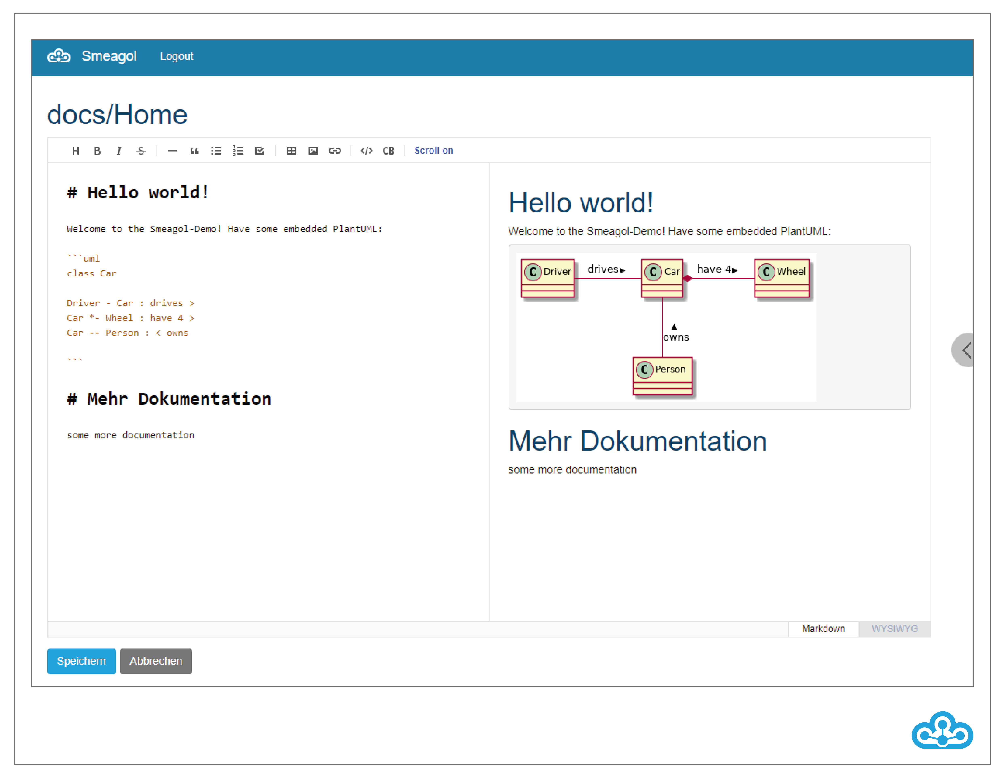
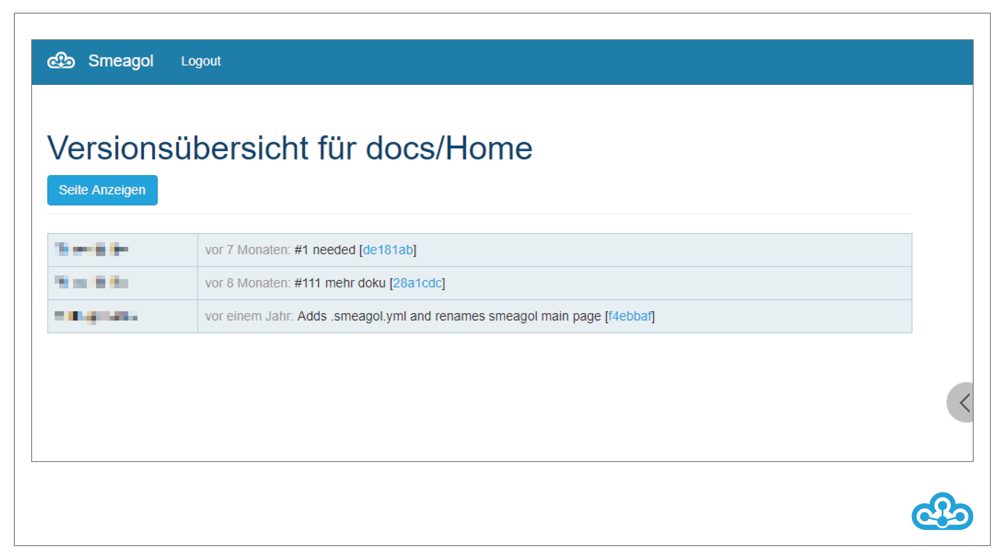

# Smeagol
Smeagol ist ein Wiki-System auf Basis eines Git-Repository. Das bedeutet, dass nicht nur der Quellcode des Softwareprodukts, sondern auch die zugehörige Dokumentation im Git Repository versioniert wird. Dadurch ist die Dokumentation genau dort, wo sie auch hin gehört – direkt neben dem Source Code.  \newline

Die Dokumentation kann bequem über eine Weboberfläche aufgerufen werden, wobei jede Nutzerin und jeder Nutzer die Wikis der Repositories sehen kann, auf die er auch im SCM-Manager Zugriff hat. Die Funktion der Weboberfläche ist aber nicht nur auf die Anzeige der Inhalte beschränkt: Sie erlaubt es der Nutzerin und dem Nutzer auch, die Dokumentation zu bearbeiten (inklusive Live-Vorschau) und die bereits erstellten Inhalte zu durchsuchen. Darüber hinaus kann man sich die Versionshistorie der Wikis, eine Übersicht aller Dokumentationsdateien eines Repository, sowie globale Änderungen anzeigen lassen.  \newline

Um Smeagol für ein Repository verwenden zu können, muss lediglich eine leere \newline
".smeagol.yml-Datei" im Root-Verzeichnis des Repository angelegt werden. Anschlie\ss end kann die Dokumentation entweder auf der Smeagol-Weboberfläche oder über einen gängigen Editor erstellt werden, je nachdem wie  bevorzugt gearbeitet wird. Diesen Prozess finden Sie nachfolgend skizziert.

Über die Weboberfläche können bestehende Seiten verändert und neue angelegt werden. Sobald Änderungen gespeichert werden, führt Smeagol automatisch einen Push an das Repository durch und versioniert damit die Dokumentation. Bei der Verwendung eines Editors muss dies manuell geschehen. Für die Erstellung der Dokumentation kann zwischen mehreren Syntaxen, wie z.B. Markdown oder Rdoc, gewählt werden.

Wenn diese Datei in das Repository hinzugefügt wurde, wird das Wiki in der Liste in Smeagol angezeigt.

\pagebreak

Wenn Sie auf das Wiki klicken, bekommen Sie eine Übersicht aller Branches in dem Repository.

Mit einem Klick auf den gewünschten Branch werden Sie auf die Wiki-Seite weitergeleitet.
Mit der Suchfunktion kann das Wiki nach Begriffen durchsucht werden. Mit dem Button "Startseite" werden Sie wieder auf die erste Seite des Wikis geleitet.

\pagebreak

Unter "Seiten" sind alle zugehörigen Wiki-Seiten aufgelistet:

Mit "Neu" wird eine neue Wiki-Seite erstellt. Sie müssen einen Namen für die Seite festlegen und können anschlie\ss end mit "OK" die Seite anlegen.

\pagebreak

Unter "Umbenennen" können Sie die aktuell ausgewählte Seite umbenennen. Dafür geben Sie den neuen Namen an und bestätigen mit "OK".

\pagebreak

Über "Löschen" können Seiten wieder gelöscht werden.

Unter "Bearbeiten" öffnet sich der Editor und Sie können die Seite direkt im Browser ändern. Sie haben die Möglichkeit, sich neben der Bearbeitung eine Vorschau anzeigen zu lassen ("Markdown") oder einen zusammengefassten Editor zu nutzen ("WYSIWYG"). Mit einem Kommentar können Sie Änderungen an der Seite speichern.

\pagebreak

In der Versionsübersicht werden alle Änderungen der gerade ausgewählten Wiki-Seite angezeigt.

