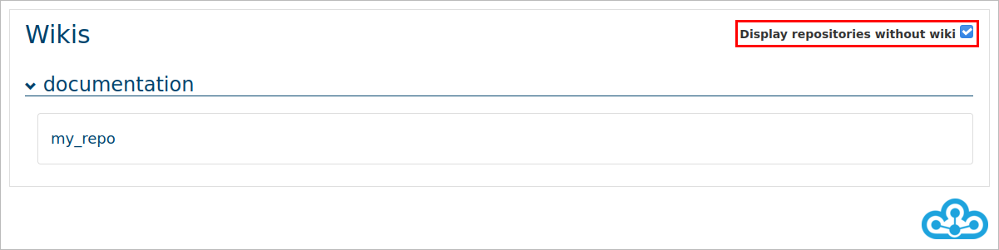
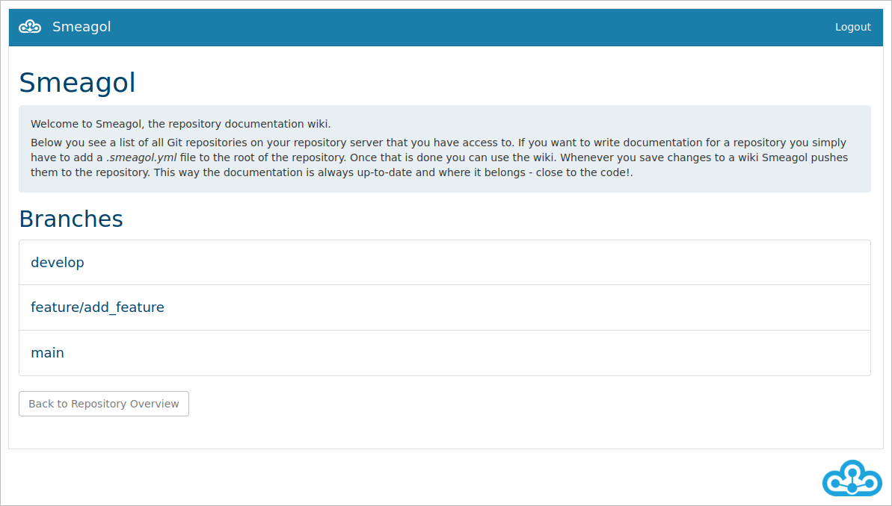
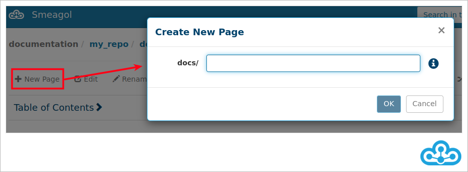
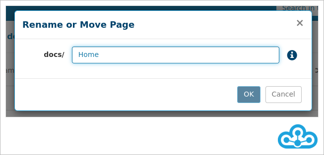
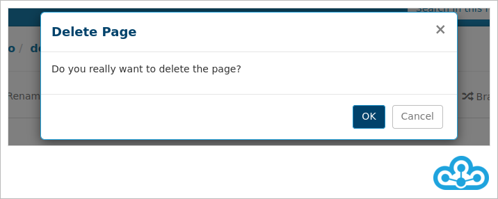
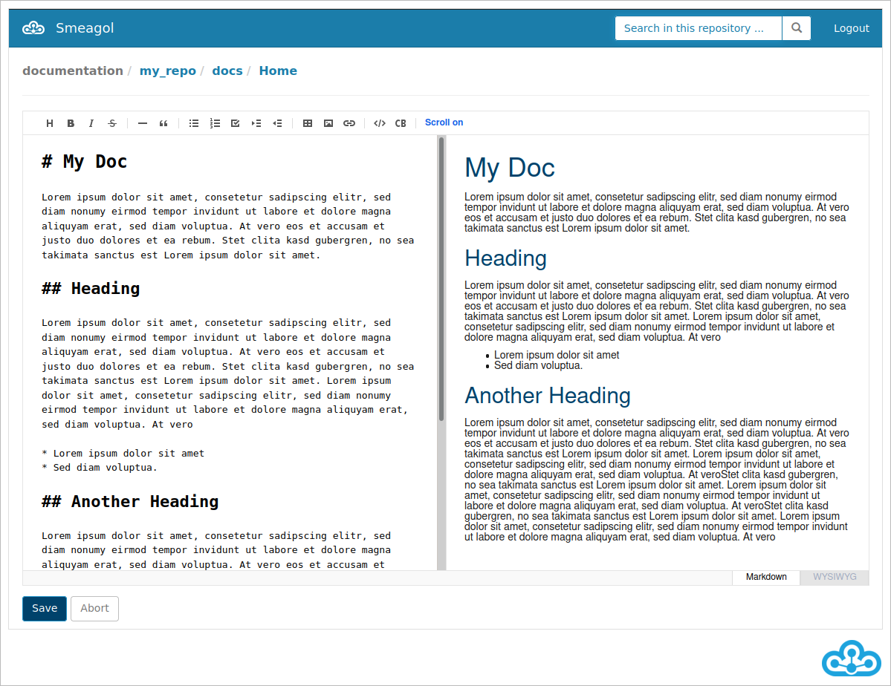
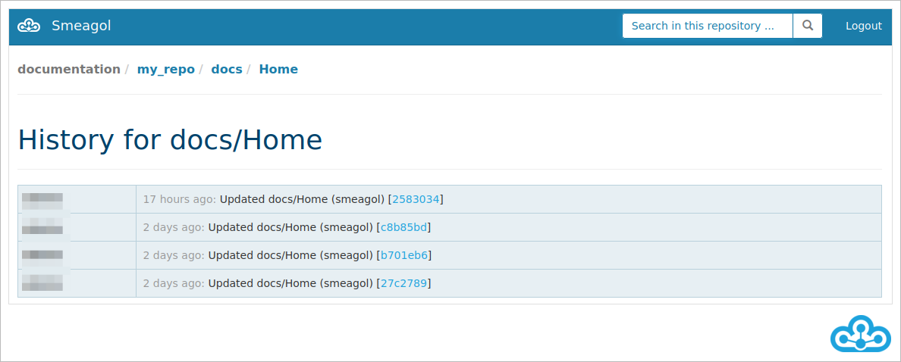
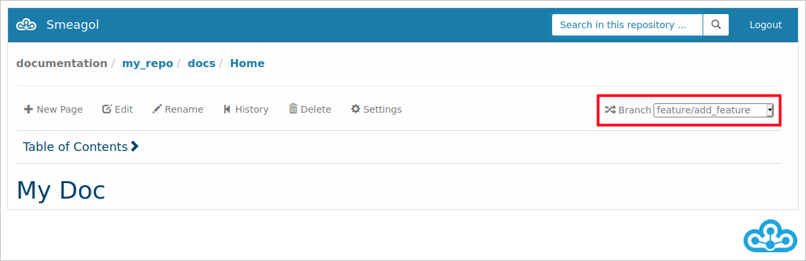

# GUI

Translated with www.DeepL.com/Translator

Smeagol is a wiki system based on a Git repository. This means that not only the source code of the software product, but also the corresponding documentation is versioned in the Git repository. This way the documentation is exactly where it belongs - right next to the source code.  

The documentation can be conveniently accessed via a web interface, where each user can see the wikis of the repositories to which he or she also has access in the SCM Manager. The function of the web interface is not only limited to displaying the content: it also allows the user to edit the documentation (including live preview and support for creating diagrams using PlantUML syntax) and to search the content already created. In addition, it is possible to view the version history of the wikis, an overview of all documentation files in a repository, as well as global changes. Furthermore, settings such as the start page and the directory in which the documentation should be stored can be made.

To use Smeagol for a repository, all you need to do is create an empty
".smeagol.yml" file in the root directory of the repository. This can also be done directly in the web interface. By default, repositories without wiki are hidden. To display them, the checkbox "Display repositories without wiki" must be activated in the overview.

If a repository without a wiki is selected in the web interface, a new wiki can be created by clicking on the "Initialize wiki" button after selecting the branch on which to work (the smeagol.yml is created automatically).

Subsequently, the documentation can be created either on the Smeagol web interface or via a common editor, depending on how it is preferred to work. This process is outlined below.

Existing pages can be modified and new ones created via the web interface. As soon as changes are saved, Smeagol automatically performs a push to the repository, versioning the documentation. When using an editor, this has to be done manually. There are several syntaxes to choose from for creating the documentation, such as Markdown or Rdoc.

All repositories that have a smeagol.yml are displayed in the wiki overview.

If you click on the wiki, you get an overview of all branches in the repository.

By clicking on the desired branch you will be redirected to the wiki page.
With the search function you can search the wiki for terms. With the button "Home" you will be redirected to the first page of the wiki.
The root directory (by default "docs") and the main page (i.e. the page that is displayed first when the repository is selected) can also be customized via the "Settings" button.

A simple navigation through the wiki is possible via the breadcumb. For example, if you want to list all pages of the corresponding wiki, just click on the top directory "docs".

For long wikis, the fold-out table of contents is a great help. It is automatically updated when changes are made to the wiki and is based on the headings. These serve as jumping points to the respective section.

Under "Pages" all related wiki pages are listed:

Click "New" to create a new wiki page. You have to define a name for the page and then click "OK" to create the page.

Under "Rename" you can rename the currently selected page. To do this, enter the new name and confirm with "OK".

With "Delete" pages can be deleted again.

Under "Edit" the editor opens and you can change the page directly in the browser. You have the possibility to display a preview next to the editing ("Markdown") or to use a summarized editor ("WYSIWYG"). With a comment you can save changes to the page.

The version history shows all changes of the currently selected wiki page.

The branch selected at the beginning can be changed on the right in branch-dropdown in the menu bar.

