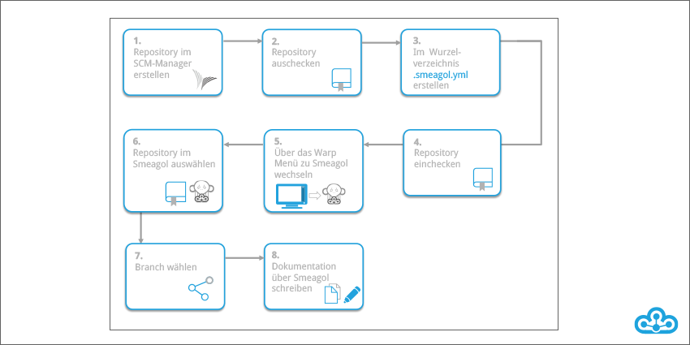
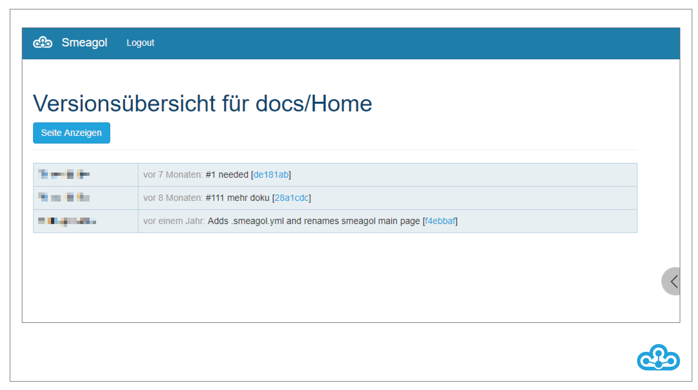

Translated with www.DeepL.com/Translator

# Smeagol
Smeagol is a wiki system based on a Git repository. This means that not only the source code of the software product, but also the corresponding documentation is versioned in the Git repository. This way the documentation is exactly where it belongs - right next to the source code.  \newline

The documentation can be conveniently accessed via a web interface, where every user can see the wikis of the repositories to which he or she also has access in the SCM Manager. However, the function of the web interface is not limited to displaying the content: it also allows the user to edit the documentation (including live preview) and search the content already created. In addition, it is possible to view the version history of the wikis, an overview of all documentation files in a repository, as well as global changes.  \newline

To use Smeagol for a repository, you only need to create an empty \newline
".smeagol.yml" file in the root directory of the repository. Anschlie\ss end, the documentation can be created either on the Smeagol web interface or via a common editor, depending on how it is preferred to work. This process is outlined below.

Existing pages can be modified and new ones created via the web interface. As soon as changes are saved, Smeagol automatically performs a push to the repository, versioning the documentation. When using an editor, this has to be done manually. There are several syntaxes to choose from for creating the documentation, such as Markdown or Rdoc.

When this file is added to the repository, the wiki will be shown in the list in Smeagol.

\pagebreak

If you click on the wiki, you get an overview of all branches in the repository.

By clicking on the desired branch you will be redirected to the wiki page.
With the search function you can search the wiki for terms. With the button "Home" you will be redirected to the first page of the wiki.

\pagebreak

Under "Pages" all related wiki pages are listed:

Click "New" to create a new wiki page. You have to define a name for the page and then click "OK" to create the page.

\pagebreak

Under "Rename" you can rename the currently selected page. To do this, enter the new name and confirm with "OK".

\pagebreak

With "Delete" pages can be deleted again.

Under "Edit" the editor opens and you can change the page directly in the browser. You have the possibility to display a preview next to the editing ("Markdown") or to use a summarized editor ("WYSIWYG"). With a comment you can save changes to the page.

\pagebreak

The version history shows all changes of the currently selected wiki page.

